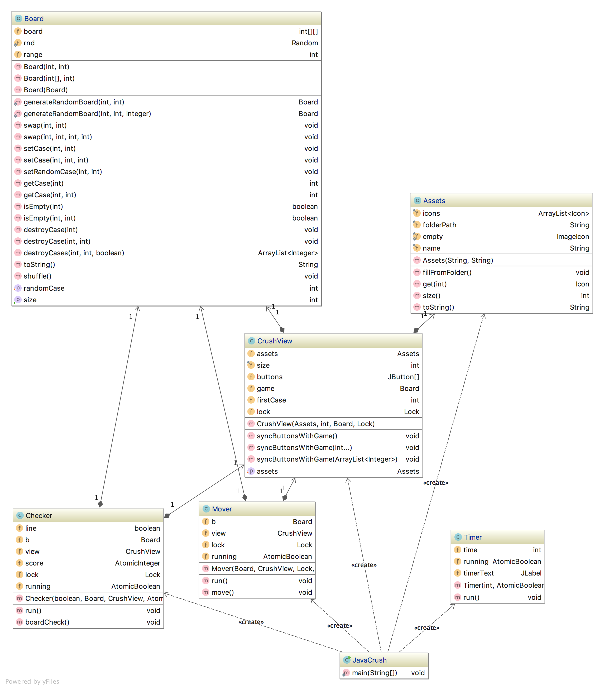

# JavaCrush
## Architecture

### Model and View

This program is implemented using a sort of MVC approach, more specifically a Model and a View distinct. We have the class `Board` that denotes the game board model, with the different methods for setting cases, deleting them etc. And then we have `ViewCrush` that will be our JPanel that will display our board. This view takes care of listening for clicks on the `JButton` that are used to display the different tiles. This class has methods to "sync" the view with the model, by that I mean updating the buttons to show the current state of the board. We want to update only the necessary buttons, so we have different versions of `syncButtonsWithGame(...)` that we can call with nothing and it will update the whole board or with a list of indexes to update.

Then we have the `Assets` class that is used to allocate our different icon packs. Instead of allocating 100 icons for 10x10 grid when there are really 10 or 11 different icons, in the `Assets` class, we create an ArrayList of Icons from a path given to the constructor and methods to get an icon for a specific value.

### Game logic and Multithreading
