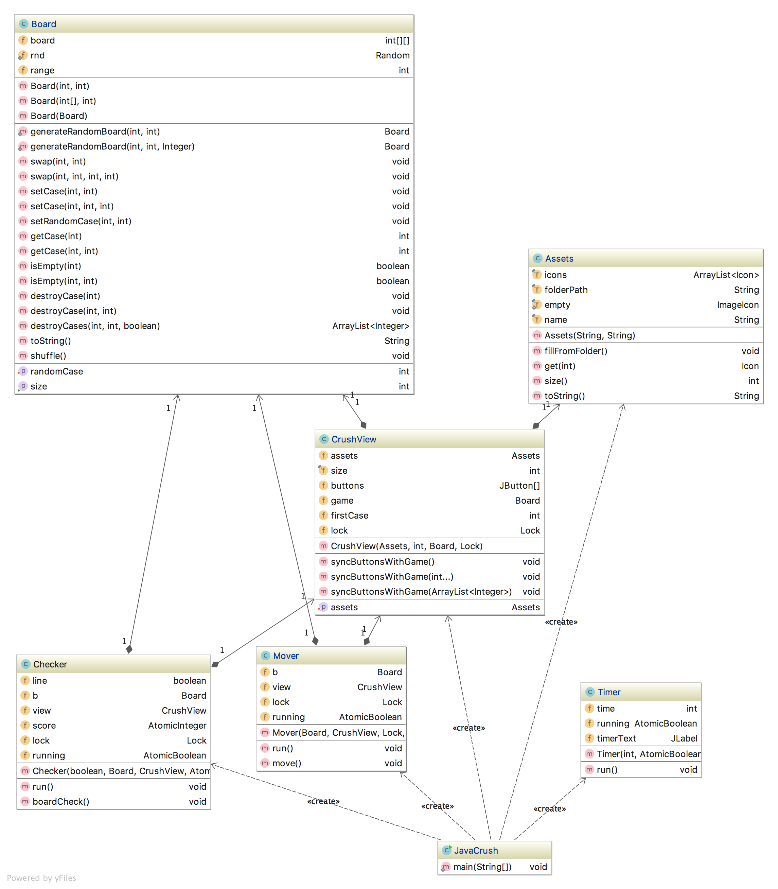

# JavaCrush
## Architecture

## Vue et modèle
Ce programme a été implementé avec un modèle MVC, nous avons donc la vue `ViewCrush` qui ne sert qu'à afficher les cases du modèle, representé par la classe `Board` qui contient les méthodes pour swaper des cases, les supprimer etc.

Dans la classe `ViewCrush`, nous avons ensuite plusieurs surcharges de la méthode `syncButtonsWithGame(...)` qui permet de mettre à jour la vue par rapport au modèle pour toute la board ou pour certaines cases uniquement.

Il y a également la classes `Assets` qui permet de définir un icon pack. A partir d'un chemin de dossier, on va créer une liste d'Icon, ce qui nous permet d'allouer uniquenent les n icônes différentes plutôt que les 100 icônes de la board. Notre vue contient un objet de type `Assets` et à dans cette classe nous avons des méthode pour obtenir l'icône correspondante à une valeur. Nous pouvons également facilement remplacer cet `Assets` en utilisant la méthode `setAsset(...)` de `ViewCrush`.

Au niveau du controleur, nous détectons les clicks sur les buttons en stockant la valeur du premier click dans une variable et ensuite lors d'un click, si cette variable était déjà set, nous procédons au swap s'il s'agit d'un mouvement valide, autrement nous remettons cette variable à -1.

## Threads et logique du jeu
Nous avons donc 2 threads qui servent à checker la board (un en horizontal et un en vertical) et qui suppriment les cases "gagnantes". Ensuite nous avons également un thread qui va cascader les cases par dessus les cases vides et générer des nouvelles cases au sommet des colonnes. Ces threads sont synchronisés au moyen d'un lock.

Tout thread qui fait des modifications sur la board est en section critique, c'est à dire qu'on verouille le mutex et on le déverouille à la fin. Ceci comprend par exemple un lock autour de la partie qui swap les cases dans le click listener de la vue, puis ensuite autour de l'execution de chaque thread de check et de move.

Ceci rend malheureusement l'exécution du programme quasiment entièrement séquentielle mais nous ne pouvons pas faire autrement car un programme comme celui-ci ne se prête pas forcément au mltithreading. Le multithreading ici nous permet surtout de séparer les différentes tâches dans leur propre thread.

On pourrait imaginer de faire les checks verticaux et horizontaux simultanément par exemple en faisant checker une copie du tableau et en modifiant le tableau réel, mais il faudrait tout de même faire en sorte qu'aucun thread ne commence tant que toutes les copies ne sont pas finies.

## Classe JavaCrush et main()
Dans la classe JavaCrush, nous avons notre fonction main qui crée les différents objets et threads ainsi que plusieurs `Assets` par défaut. Au lancement du programme, une fenêtre va s'afficher pour choisir la durée du jeu et ensuite la fenêtre principale s'affiche. Dans cette fenêtre nous avons un menu déroulant pour modifier le thème du jeu ainsi qu'un affichage en temps réel du temps restant.

A la fin du temps de jeu, la classe Timer va mettre le flag `running` qui est partagé entre tous les threads à false. Lorsque ce flag est false, tous les threads vont se terminer et ensuite nous pouvons join nos threads dans le main, afficher le score et quitter le programme lors de la fermeture de la popup du score.
